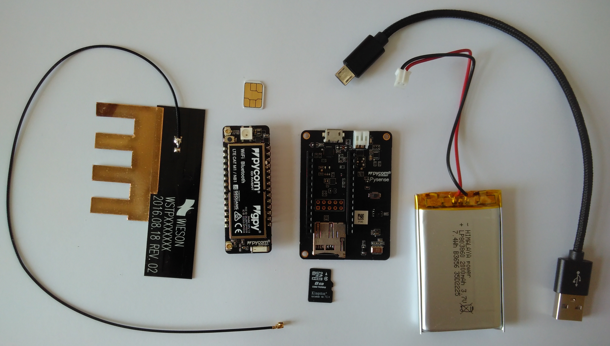
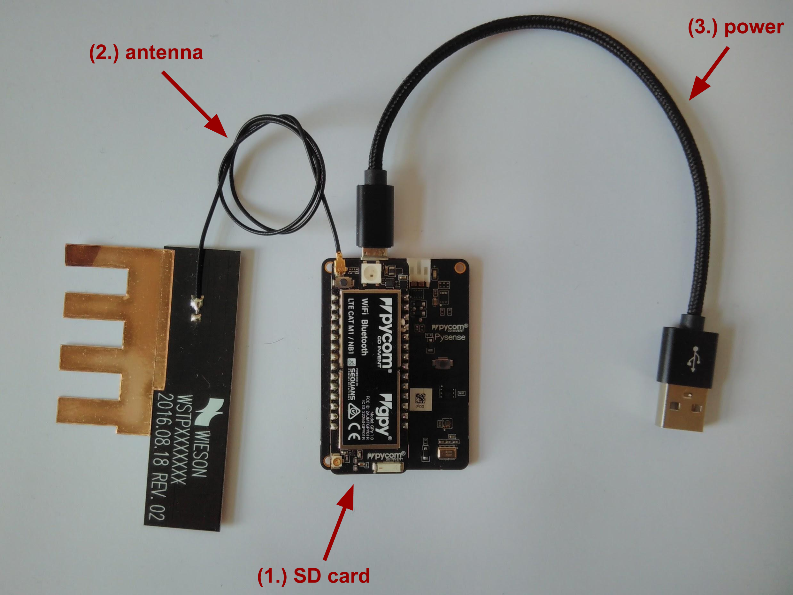

# UBIRCH TestKit



### Components
- 1NCE SIM Card with SIGNiT application
- Pycom GPy
- Pycom Pysense
- Pycom LTE antenna
- micro SD card
- micro USB cable

### What you need
- micro SD card writer

### Quick Start
  **(TODO: IMSI claiming not implemented yet)**
1. Claim your SIM card identity (IMSI) at the [UBIRCH web UI](https://console.demo.ubirch.com):  (TODO: bootstrapping currently only deployed on dev stage -> go to **https://console.dev.ubirch.com** for now)
    - Login or register if you don't have an account yet.
    - Go to **Things** (in the menu on the left) and click on `+ ADD NEW DEVICE`.
    - Enter the IMSI of your SIM card to the **ID** field, add a description for your device (e.g. "TestKit") and click on `register`.
    - Click on your device (IMSI) in the overview and copy the `apiConfig`.
    
1. Configure your device:
    * Create a file `config.txt` on the SD card and paste the `apiConfig` from the previous step into it. It should look like this:
    ```json
    {
        "password": "xxxxxxxx-xxxx-xxxx-xxxx-xxxxxxxx",
        "keyService": "https://key.demo.ubirch.com/api/keyService/v1/pubkey/mpack",
        "niomon": "https://niomon.demo.ubirch.com/",
        "data": "https://data.demo.ubirch.com/v1/msgPack"
    }
    ```
    * Insert the SD card into the Pysense. [(1.)](#assembled-testkit)
1. Make sure the cellular antenna is attached to the Gpy [(2.)](#assembled-testkit) and power up the TestKit with the micro USB cable. [(3.)](#assembled-testkit)
> WARNING: Using LTE/NB-IoT connectivity without the antenna being attached could damage the development board!

###### Assembled TestKit



**That's it!** Once powered up, the program on the TestKit starts running automatically.

### How it works
On initial start up, the TestKit will load the configuration from the SD card, connect to the NB-IoT network (APN: *iot.1nce.net*)
 and perform a bootstrap with the UBIRCH backend to acquire the SIM card's PIN via HTTPS.
 Once the SIM card is unlocked, the device will request the x509 certificate from the SIM card's secure storage
 and use it to register the SIM card's public key at the UBIRCH backend. Now the device is ready to send signed 
 UBIRCH Protocol Packages (*UPPs*) to the backend to be anchored to the blockchain.
 
After initialisation, the device will take measurements once a minute and send a data message to the UBIRCH data service.
 The data message contains the device UUID, a timestamp and a map of the sensor data:
```json
{
    "AccPitch": "<accelerator Pitch in [deg]>",
    "AccRoll": "<accelerator Roll in [deg]>",
    "AccX": "<acceleration on x-axis in [G]>",
    "AccY": "<acceleration on y-axis in [G]>",
    "AccZ": "<acceleration on z-axis in [G]>",
    "H": "<relative humidity in [%RH]>",
    "L_blue": "<ambient light levels (violet-blue wavelength) in [lux]>",
    "L_red": "<ambient light levels (red wavelength) in [lux]>",
    "P": "<atmospheric pressure in [Pa]>",
    "T": "<external temperature in [°C]>",
    "V": "<supply voltage in [V]>"
}
```
In the next step, a **UBIRCH Protocol Package** (*"UPP"*) will be generated with the unique hash of the serialised data,
 UUID and timestamp, chained to the previous UPP and signed with the SIM card's private key using the 
 crypto functionality of the **SIGNiT** applet. The private key is stored in the secure storage of the SIM card and
 can not be read by the device.
 
The sealed data hash is then sent to the **UBIRCH authentication service** (*"Niomon"*), where it will be verified with
 the previously registered public key and anchored to the blockchain.
 
### LED
The LED on the GPy flashes blue during the initialisation process. If anything goes wrong (or initialisation finished),
 the LED will change colour:

| colour | meaning | what to do |
|--------|---------|------------|
| yellow | couldn't get config from SD card | Make sure the SD card is inserted correctly and has a file named `config.txt` with the API config from the UBIRCH web UI. The content of the file should look like the example in the previous step including the braces (`{` `}`).
| purple | couldn't connect to network (resets automatically) | Try to find a place with better signal or connect to WIFI instead. (see [here](#configuration) how to do that)
| red | couldn't acquire PIN to unlock SIM from UBIRCH backend or other backend related issue | Make sure you have registered the correct IMSI at the [UBIRCH web UI](https://console.demo.ubirch.com) and you copied the `apiConfig` for your IMSI to the `config.txt` file on the SD card.
| green | it's all good. device is measuring, sending data, sealing and sending data certificate to the UBIRCH backend| see next chapter |
| orange | sending data or data certificate to the UBIRCH backend failed |  |
| off | sleeping until the next measurement interval | 

### See the data coming in at the backend
TODO not implemented yet

### Verify the data hash in the backend
TODO not implemented yet

### Configuration
You can configure your device by adding key-value pairs to the `config.txt`-file on the SD card.
 These are the configuration options:
```
{
    "connection": "<'wifi' or 'nbiot', defaults to 'nbiot'>",
    "apn": "<APN for NB IoT connection, defaults to 'iot.1nce.net'>",
    "networks": {
        "<your WIFI SSID>": "<your WIFI password>"
    },
    "board": "<pycom expansion board type ('pysense' or 'pytrack'), defaults to 'pysense'>",
    "password": "<auth token for the ubirch backend>",
    "env": "<ubirch backend environment ('dev', 'demo' or 'prod'), defaults to 'demo'>",
    "keyService": "<key registration service URL, defaults to 'https://key.<env>.ubirch.com/api/keyService/v1/pubkey/mpack'>",
    "niomon": "<authentication service URL, defaults to 'https://niomon.<env>.ubirch.com/'>",
    "data": "<data service URL, defaults to 'https://data.<env>.ubirch.com/v1/msgPack'>",
    "verify": "<verification service URL, defaults to 'https://verify.<env>.ubirch.com/api/upp'>",
    "bootstrap": "<bootstrap service URL, defaults to 'https://api.console.<env>.ubirch.com/ubirch-web-ui/api/v1/devices/bootstrap'>",
    "logfile": <flag to enable error logging to file (true or false), defaults to 'true'>,
    "debug": <flag to enable extended debug console output (true or false), defaults to 'false'>,
    "interval": <measure interval in seconds, defaults to '60'>
}
```
There are default values for everything except for the `password`-key, but you can overwrite the default configuration
 by simply adding a key-value pair to your config file on the SD card.

The default connection type is NB-IoT, but if you can not connect to a NB-IoT network, you can change it to WIFI by adding...
```
    "connection": "wifi",
    "networks": {
      "<WIFI_SSID>": "<WIFI_PASSWORD>"
    },
```
...to your config file and replacing `<WIFI_SSID>` with your SSID and `<WIFI_PASSWORD>` with your password.

### Log file
If a SD card is present, the device will create a `log.txt`-file on the card and write an error log to it.
 This can be useful if you are having trouble with your TestKit. 

### Support
Please feel free to contact [our helpdesk](https://ubirch.atlassian.net/servicedesk/customer/portal/1) for support.